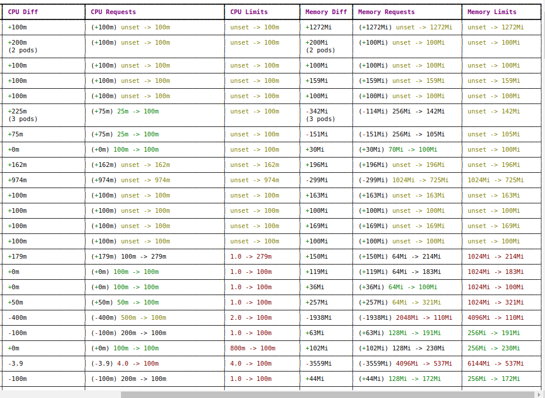

# Kubernetes Resource Recommender (KRR)

## Введение

KRR (Kubernetes Resource Recommender) — это CLI-инструмент для оптимизации использования ресурсов в Kubernetes. 
Он анализирует метрики Pod'ов, собираемые в Prometheus, и предлагает оптимальные настройки `requests` и `limits` для CPU и памяти. 
Это помогает снизить расходы на облачные ресурсы и повысить производительность приложений.
В этом посте будет расмотрен периодический запуск krr в kubernetes с сохранением в html формат для удобного  отображения.

## Зачем нужно KRR

Согласно исследованию [Sysdig](https://sysdig.com/blog/millions-wasted-kubernetes/), в среднем кластеры Kubernetes имеют:

* 69% неиспользуемого процессора
* 18% неиспользуемой памяти
Правильно подобрав размеры ваших контейнеров с помощью KRR, вы можете сэкономить в среднем 69% на облачных затратах.

## Как работает KRR

KRR получает данные из Prometheus и рассчитывает оптимальные request и limit на основе истории использования ресурсов. 
По умолчанию разработчики выставляют следующие рекомендации:
- **CPU request** на 66-й перцентиль.
- **CPU limit** на 95-й перцентиль.
- **Память** рассчитывается по максимальному использованию + буфер.

## Использование KRR из командной строки
Конечно, вы можете запустить KRR локально.

- Получение рекомендаций в терминале:
  ```sh
  krr simple-limit -p <Prometheus_URL> --formatter yaml
  ```
- Запуск с фильтрацией по namespace:
  ```sh
  krr simple-limit -p <Prometheus_URL> -n my-namespace
  ```

## Запуск KRR в виде сервиса, который будет автоматически просчитывать рекомендации по ресурсам

Но лучше чтобы рекомендации по ресурсам видели все сотрудники вашей команды.

Пример HTML работы KRR


## Для этого вам необходимо в кластере создать:

### Namespace
Код ns.yaml
```yaml
---
apiVersion: v1
kind: Namespace
metadata:
  name: krr
```

### ServiceAccount
Код sa.yaml
```yaml

---
apiVersion: v1
kind: ServiceAccount
metadata:
  name: krr-service-account
  namespace: krr
```

### ClusterRole и ClusterRoleBinding
Код ClusterRole.yaml
```yaml
---
kind: ClusterRole
apiVersion: rbac.authorization.k8s.io/v1
metadata:
  name: krr-cluster-role
rules:
  - apiGroups:
      - ""
    resources:
      - configmaps
      - daemonsets
      - deployments
      - namespaces
      - pods
      - replicasets
      - replicationcontrollers
      - services
    verbs:
      - get
      - list
      - watch
  - apiGroups:
      - ""
    resources:
      - nodes
    verbs:
      - get
      - list
      - watch
  - apiGroups:
      - apps
    resources:
      - daemonsets
      - deployments
      - deployments/scale
      - replicasets
      - replicasets/scale
      - statefulsets
    verbs:
      - get
      - list
      - watch
```

Код ClusterRoleBinding.yaml
```yaml
---
apiVersion: rbac.authorization.k8s.io/v1
kind: ClusterRoleBinding
metadata:
  name: krr-cluster-role-binding
roleRef:
  apiGroup: rbac.authorization.k8s.io
  kind: ClusterRole
  name: krr-cluster-role
subjects:
  - kind: ServiceAccount
    name: krr-service-account
    namespace: krr
```

### Deployment с контейнером KRR
Код deploy.yaml
```yaml
---
apiVersion: apps/v1
kind: Deployment
metadata:
  name: krr
  namespace: krr
spec:
  replicas: 1
  selector:
    matchLabels:
      app: krr
  template:
    metadata:
      labels:
        app: krr
    spec:
      serviceAccount: krr-service-account
      serviceAccountName: krr-service-account
      volumes:
        - name: shared-storage
          emptyDir: {}
      containers:
        - name: nginx
          image: nginx:1.27.4
          volumeMounts:
            - name: shared-storage
              mountPath: /usr/share/nginx/html
          ports:
            - containerPort: 80
        - name: krr
          image: robustadev/krr:v1.22.0
          volumeMounts:
            - name: shared-storage
              mountPath: /output
          env:
            - name: COLUMNS
              value: "400"
          command:
            - /bin/sh
            - -c
            - |
              while true; do
                TEMP_FILE="/output/index_tmp.html"
                FINAL_FILE="/output/index.html"
                python krr.py simple-limit \
                  -p https://vmselect.corp/select/0/prometheus \
                  --prometheus-label cluster -l dev \
                  --allow-hpa \
                  --use-oomkill-data \
                  --formatter html \
                  --fileoutput "$TEMP_FILE" && mv "$TEMP_FILE" "$FINAL_FILE";
                sleep 1d;
              done
          resources:
            limits:
              memory: 2Gi
            requests:
              memory: 1Gi
```

# Документация по коду deploy.yaml

Ширина html страницы регулируется с помощью переменной `COLUMNS`.

Приложение krr ходит в текущий k8s и смотрит там текущие pod, поэтому ему нужны `ClusterRole`, `ClusterRoleBinding`, `ServiceAccount`.

Для параметра `--prometheus-label cluster` нужно указать контекст для текущего кластера в VictoriaMetrics.

Используется стратегия `simple-limit`, у которой `cpu limit` = `cpu request`, так как в обычной стратегии `simple` cpu limit отключен.

Время после команды sleep указывает сколько ждать перед тем как запустить следующий раз.

Параметр `--cpu-min` по умолчанию равен 10. Но мы выставляем минимум 100.

Параметр `--cpu_request` равен 100 персентилю использования cpu

Параметр `--cpu_limit` равен 100 персентилю использования cpu. Максимальное значение лоя cpu_limit=100.

Параметр `--memory_buffer_percentage` по умолчанию 15 - Процентное соотношение добавленного буфера к пиковому объему используемой памяти для рекомендации по использованию памяти

Параметр `--oom_memory_buffer_percentage` по умолчанию 25 - На какой процент увеличить объем памяти при возникновении событий OOM Killed


### Service
Код svc.yaml
```yaml
---
apiVersion: v1
kind: Service
metadata:
  name: krr-service
  namespace: krr
spec:
  selector:
    app: krr
  ports:
    - protocol: TCP
      port: 80
      targetPort: 80
```

### Ingress для доступа к результатам
Код ingress.yaml
```yaml
---
apiVersion: networking.k8s.io/v1
kind: Ingress
metadata:
  name: krr-ingress
  namespace: krr
  annotations:
    cert-manager.io/cluster-issuer: cluster-issuer
spec:
  ingressClassName: nginx
  tls:
    - hosts:
        - krr.k8s.dev.corp
      secretName: krr-tls
  rules:
    - host: krr.k8s.dev.corp
      http:
        paths:
          - path: /
            pathType: Prefix
            backend:
              service:
                name: krr-service
                port:
                  number: 80
```

## Разница с Kubernetes VPA

На странице [Github KRR](https://github.com/robusta-dev/krr) показана разница с k8s VPA

## Заключение

KRR — мощный инструмент для автоматической оптимизации ресурсов в Kubernetes, 
который помогает экономить **CPU** и **память**. 
Простота настройки и гибкость интеграции делают его отличным выбором для DevOps-инженеров.

